# Architecture Documentation

Comprehensive architecture documentation for the BlihOps Talent & Employer Platform.

## 📋 Table of Contents

- [System Overview](#system-overview)
- [High-Level Architecture](#high-level-architecture)
- [Component Architecture](#component-architecture)
- [Data Flow](#data-flow)
- [Authentication Flow](#authentication-flow)
- [Telegram Bot Architecture](#telegram-bot-architecture)
- [Matching Algorithm Flow](#matching-algorithm-flow)
- [Deployment Architecture](#deployment-architecture)
- [Technology Stack](#technology-stack)
- [System Scalability](#system-scalability)
- [Security Architecture](#security-architecture)
- [Monitoring & Observability](#monitoring--observability)
- [Production Essentials](#production-essentials)
- [Architecture Decisions](#architecture-decisions)

## 🏗️ System Overview

The BlihOps Talent Platform is a monorepo-based, multi-service application consisting of:

1. **API Backend** - NestJS REST API
2. **Unified Telegram Bot** - Single bot with role-based access (talent onboarding + job posting)
3. **Admin Web** - Next.js 15 admin dashboard
4. **Queue System** - BullMQ with Redis for reliable job processing
5. **Database** - PostgreSQL 16+ with JSONB for flexible fields
6. **Session Store** - Redis for bot session management
7. **Public Channels** - Telegram channels for public visibility
8. **Observability** - Sentry + structured logging (Pino)

## 🎯 High-Level Architecture


## 📦 Component Architecture

### Monorepo Structure


### API Backend Module Structure


## 🔄 Data Flow

### Talent Onboarding Flow


### Job Creation Flow


### Admin Dashboard Data Flow


## 🔐 Authentication Flow

### Web Authentication (Admin Dashboard)


### Telegram Bot Authentication & Role-Based Access


## 🤖 Telegram Bot Architecture

### Unified Bot with Role-Based Access

The platform uses a **single Telegram bot** with role-based command access, reducing code duplication and operational complexity.

**Framework Choice**: **grammY** is preferred over Telegraf in 2026 due to:
- Better TypeScript support and type safety
- Superior plugin ecosystem
- Improved performance and developer experience
- Active development and growing community
- Better scene management for complex workflows
- More modern API design

### Bot Architecture


### Talent Onboarding State Machine


### Admin Job Creation State Machine


### Rate Limiting & Flood Control


## 🎯 Matching Algorithm Flow

### On-the-Fly Matching (Recommended)

Matches are computed **on-demand** rather than pre-calculated, reducing database writes and ensuring real-time accuracy.


### Background Matching (Optional)

For high-volume scenarios, background workers can pre-compute and cache matches.


### Matching Score Calculation

```mermaid
graph LR
    subgraph "Matching Factors"
        SC[Service Category<br/>Weight: 30%]
        SO[Skill Overlap<br/>Weight: 40%]
        EL[Experience Level<br/>Weight: 20%]
        AV[Availability<br/>Weight: 10%]
    end
    
    subgraph "Score Calculation"
        CALC[Weighted Sum<br/>Score = SC×0.3 + SO×0.4 + EL×0.2 + AV×0.1]
    end
    
    subgraph "Output"
        RANK[Ranked List<br/>Top Matches]
    end
    
    SC --> CALC
    SO --> CALC
    EL --> CALC
    AV --> CALC
    CALC --> RANK
    
    style CALC fill:#4F46E5
    style RANK fill:#10B981
```



## 🚀 Deployment Architecture

### VPS + Docker Deployment

Production deployment on Linux VPS using Docker and Docker Compose for containerization and orchestration.


### Docker Compose Architecture


### VPS Requirements

**Minimum VPS Specifications**:
- **CPU**: 2-4 cores
- **RAM**: 4-8 GB
- **Storage**: 50-100 GB SSD
- **OS**: Ubuntu 22.04 LTS or Debian 12
- **Network**: Public IP with ports 80, 443, 22 open

**Recommended VPS Specifications** (Production):
- **CPU**: 4-8 cores
- **RAM**: 8-16 GB
- **Storage**: 100-200 GB SSD
- **Backup**: Automated daily backups
- **Monitoring**: Resource monitoring (htop, netdata)

### Docker Setup

**Services**:
- `api-backend` - NestJS API (port 3000)
- `admin-web` - Next.js admin dashboard (port 3001)
- `telegram-bot` - Unified Telegram bot
- `bullmq-worker` - Background job workers (scalable)
- `postgres` - PostgreSQL 16+ (port 5432, internal only)
- `redis` - Redis 7+ (port 6379, internal only)

**Volumes**:
- `postgres_data` - Persistent PostgreSQL data
- `redis_data` - Persistent Redis data
- `app_storage` - Application files, CVs, uploads

### Service Access

Services are directly accessible via their exposed ports:

- **API Backend**: `http://your-vps-ip:3000` or domain pointing to port 3000
- **Admin Web**: `http://your-vps-ip:3001` or domain pointing to port 3001
- **Telegram Bot**: Webhook configured to point directly to bot service
- **PostgreSQL**: Internal only (port 5432, not exposed externally)
- **Redis**: Internal only (port 6379, not exposed externally)

**Note**: For production, consider adding a reverse proxy (Nginx/Caddy) later for SSL/TLS termination and domain routing.

## 🗄️ Database Schema

### PostgreSQL Schema Design

Using PostgreSQL 16+ with JSONB for flexible fields and strong relational integrity.

### Entity Relationship Diagram


### Key Indexes

```sql
-- Performance-critical indexes
CREATE INDEX idx_talent_telegram_id ON talents(telegram_id);
CREATE INDEX idx_talent_status ON talents(status) WHERE status = 'approved';
CREATE INDEX idx_talent_category ON talents(service_category);
CREATE INDEX idx_talent_skills ON talents USING GIN(skills);
CREATE INDEX idx_job_status ON jobs(status) WHERE status = 'published';
CREATE INDEX idx_job_category ON jobs(service_category);
CREATE INDEX idx_job_skills ON jobs USING GIN(required_skills);
CREATE INDEX idx_audit_timestamp ON audit_logs(timestamp DESC);
CREATE INDEX idx_audit_resource ON audit_logs(resource_type, resource_id);
```

### Future: pgvector Extension

For semantic matching (Phase 2+):

```sql
-- Enable pgvector for embeddings
CREATE EXTENSION vector;

-- Add embedding columns
ALTER TABLE talents ADD COLUMN skill_embeddings vector(1536);
ALTER TABLE jobs ADD COLUMN skill_embeddings vector(1536);

-- Vector similarity index
CREATE INDEX idx_talent_embeddings ON talents 
USING ivfflat (skill_embeddings vector_cosine_ops);
```

## 🔄 Event-Driven Architecture

### BullMQ-Based Job Queue System

Using BullMQ (Redis-backed) for reliable, observable job processing instead of external automation tools.

### Event Flow


### Job Queue Architecture


### Event Types

```mermaid
graph TD
    EVENTS[Event Types] --> TALENT_EVENTS[Talent Events]
    EVENTS --> JOB_EVENTS[Job Events]
    EVENTS --> MATCH_EVENTS[Matching Events]
    EVENTS --> ADMIN_EVENTS[Admin Events]
    
    TALENT_EVENTS --> T1[talent.created]
    TALENT_EVENTS --> T2[talent.updated]
    TALENT_EVENTS --> T3[talent.approved]
    TALENT_EVENTS --> T4[talent.rejected]
    
    JOB_EVENTS --> J1[job.created]
    JOB_EVENTS --> J2[job.updated]
    JOB_EVENTS --> J3[job.published]
    JOB_EVENTS --> J4[job.archived]
    
    MATCH_EVENTS --> M1[match.calculated]
    MATCH_EVENTS --> M2[match.updated]
    
    ADMIN_EVENTS --> A1[admin.action]
    
    style EVENTS fill:#4F46E5
```

## 🛠️ Technology Stack

### Technology Stack Diagram

```mermaid
graph TB
    subgraph "Frontend"
        NEXT[Next.js 15]
        REACT[React 19]
        TAILWIND[Tailwind CSS v4]
        SHADCN[shadcn/ui]
        RQ[React Query<br/>Optional]
    end
    
    subgraph "Backend"
        NEST[NestJS]
        TS[TypeScript]
        PRISMA[Prisma<br/>ORM]
    end
    
    subgraph "Telegram Bot"
        GRAMMY[grammY]
        SCENES[Scene Manager]
        REDIS_SESS[Redis Sessions]
    end
    
    subgraph "Database & Cache"
        PG[PostgreSQL 16+]
        REDIS[(Redis)]
        JSONB[JSONB Fields]
        GIN[GIN Indexes]
    end
    
    subgraph "Queue System"
        BULLMQ[BullMQ]
        WORKERS[Worker Processes]
    end
    
    subgraph "Observability"
        SENTRY[Sentry]
        PINO[Pino Logger]
    end
    
    subgraph "Deployment"
        VPS[Linux VPS]
        DOCKER[Docker + Docker Compose]
    end
    
    NEXT --> REACT
    NEXT --> TAILWIND
    NEXT --> SHADCN
    NEXT --> NEST
    
    NEST --> TS
    NEST --> PRISMA[Prisma<br/>ORM]
    NEST --> PG
    NEST --> REDIS
    NEST --> BULLMQ
    NEST --> SENTRY
    NEST --> PINO
    
    GRAMMY --> NEST
    GRAMMY --> REDIS_SESS
    REDIS_SESS --> REDIS
    
    BULLMQ --> REDIS
    WORKERS --> BULLMQ
    WORKERS --> NEST
    WORKERS --> PG
    
    PG --> JSONB
    PG --> GIN
    
    DOCKER --> NEST
    DOCKER --> NEXT
    DOCKER --> GRAMMY
    DOCKER --> PG
    DOCKER --> REDIS
    VPS --> DOCKER
    
    style NEXT fill:#8B5CF6
    style NEST fill:#4F46E5
    style PG fill:#10B981
    style REDIS fill:#DC2626
    style BULLMQ fill:#F59E0B
    style GRAMMY fill:#06B6D4
    style SENTRY fill:#362D59
```

### Technology Choices & Rationale

| Component | Technology | Rationale |
|-----------|-----------|-----------|
| **Database** | PostgreSQL 16+ | Strong consistency, transactions, GIN indexes for arrays, future pgvector support |
| **Cache/Queue** | Redis | Session storage, job queues (BullMQ), rate limiting |
| **Queue System** | BullMQ | Reliable, observable, Redis-backed, better than n8n for production |
| **Bot Framework** | **grammY** (preferred) | Modern, TypeScript-first, better DX, plugins, performance. Telegraf is solid but grammY has overtaken in 2026 |
| **ORM** | **Prisma** | Type-safe database access, excellent TypeScript support, robust migrations, superior DX |
| **Frontend** | Next.js 15.5+ | Next.js 15.5+ adds stable Turbopack builds. Full-stack capabilities with Server Actions |
| **Observability** | Sentry + Pino | Error tracking + structured logging (MVP-appropriate) |
| **Queue Monitoring** | BullMQ Board or Upqueue.io | Essential for debugging silent failures, job monitoring |
| **File Storage** | **Docker Volumes** | Docker volumes for all environments (dev/staging/prod). Simple, cost-effective, adequate for MVP scale |
| **Deployment** | **VPS + Docker** | Linux VPS with Docker Compose. Full control, cost-effective, scalable |

## 📊 System Scalability

### Horizontal Scaling Strategy

```mermaid
graph TB
        subgraph "Load Balancer"
        LB[Load Balancer<br/>Optional for Scaling]
    end
    
    subgraph "API Tier (Stateless)"
        API1[API Instance 1]
        API2[API Instance 2]
        API3[API Instance N...]
    end
    
    subgraph "Web Tier (Stateless)"
        WEB1[Web Instance 1]
        WEB2[Web Instance 2]
        WEB3[Web Instance N...]
    end
    
    subgraph "Bot Tier (Stateful)"
        BOT[Unified Bot<br/>Sticky Sessions or<br/>Redis Session Store]
    end
    
    subgraph "Worker Tier"
        WORKER1[BullMQ Worker 1]
        WORKER2[BullMQ Worker 2]
        WORKER3[BullMQ Worker N...]
    end
    
    subgraph "Database Tier"
        PG_PRIMARY[(PostgreSQL Primary)]
        PG_REPLICA1[(PostgreSQL Replica 1)]
        PG_REPLICA2[(PostgreSQL Replica 2)]
    end
    
    subgraph "Cache/Queue Tier"
        REDIS_CLUSTER[(Redis Cluster)]
    end
    
    LB --> API1
    LB --> API2
    LB --> API3
    LB --> WEB1
    LB --> WEB2
    LB --> WEB3
    
    API1 --> PG_PRIMARY
    API2 --> PG_PRIMARY
    API3 --> PG_PRIMARY
    API1 --> REDIS_CLUSTER
    API2 --> REDIS_CLUSTER
    API3 --> REDIS_CLUSTER
    
    BOT --> API1
    BOT --> API2
    BOT --> REDIS_CLUSTER
    
    WORKER1 --> PG_PRIMARY
    WORKER1 --> REDIS_CLUSTER
    WORKER2 --> PG_PRIMARY
    WORKER2 --> REDIS_CLUSTER
    
    PG_PRIMARY --> PG_REPLICA1
    PG_PRIMARY --> PG_REPLICA2
    
    style LB fill:#3B82F6
    style PG_PRIMARY fill:#10B981
    style REDIS_CLUSTER fill:#DC2626
    style BOT fill:#06B6D4
```

### Scaling Considerations

- **API & Web**: Stateless, scale horizontally easily
- **Bot**: Stateful (conversation state), use Redis session store for stateless scaling
- **Workers**: Stateless job processing, scale based on queue depth
- **PostgreSQL**: Read replicas for read-heavy workloads
- **Redis**: Cluster mode for high availability

## 🔒 Security Architecture

### Security Layers

```mermaid
graph TB
    subgraph "External Layer"
        INTERNET[Internet]
    end
    
    subgraph "Network Layer"
        FIREWALL[Firewall]
    end
    
    subgraph "Application Layer"
        MW[Middleware<br/>Auth Check]
        RBAC[Role-Based Access]
        VALID[Input Validation]
        RATE[Rate Limiting]
    end
    
    subgraph "Data Layer"
        ENCRYPT[Data Encryption]
        AUDIT[Audit Logging]
    end
    
    INTERNET --> FIREWALL
    FIREWALL --> LB
    LB --> MW
    MW --> RBAC
    RBAC --> VALID
    VALID --> RATE
    RATE --> ENCRYPT
    ENCRYPT --> AUDIT
    
    style FIREWALL fill:#EF4444
    style LB fill:#3B82F6
    style RBAC fill:#F59E0B
    style ENCRYPT fill:#10B981
```

## 📈 Monitoring & Observability

### MVP-Optimized Observability Stack

For Phase 1 (MVP), focus on essential observability without over-engineering.

```mermaid
graph LR
    subgraph "Application"
        API[API Backend]
        BOT[Telegram Bot]
        WEB[Admin Web]
        WORKER[BullMQ Workers]
    end
    
    subgraph "Error Tracking"
        SENTRY[Sentry<br/>Error Monitoring]
    end
    
    subgraph "Logging"
        PINO[Pino<br/>Structured Logging]
        STDOUT[stdout/stderr]
    end
    
    subgraph "Queue Monitoring"
        BULLMQ_UI[BullMQ Board<br/>or Upqueue.io<br/>Essential]
    end
    
    API --> SENTRY
    API --> PINO
    BOT --> SENTRY
    BOT --> PINO
    WEB --> SENTRY
    WORKER --> SENTRY
    WORKER --> PINO
    
    PINO --> STDOUT
    WORKER --> BULLMQ_UI
    
    style SENTRY fill:#362D59
    style PINO fill:#10B981
    style BULLMQ_UI fill:#F59E0B
```

### Production Essentials

#### Queue Monitoring (Critical)

**Why it matters**: Silent failures in job queues are a common production pain point. Early monitoring prevents missed publications and notifications.

```mermaid
graph TB
    QUEUE[BullMQ Queue] --> REDIS[(Redis)]
    REDIS --> MONITOR[BullMQ Board<br/>or Upqueue.io]
    MONITOR --> ALERTS[Alert on Failures]
    MONITOR --> METRICS[Job Metrics]
    MONITOR --> RETRY[Manual Retry]
    
    style MONITOR fill:#F59E0B
    style ALERTS fill:#EF4444
```

**Recommended Tools**:
- **BullMQ Board**: Open-source, self-hosted dashboard
- **Upqueue.io**: Managed service with better UX
- **Integration**: Expose via `/admin/queues` route in admin dashboard

**Key Metrics to Monitor**:
- Failed jobs count
- Job processing time
- Queue depth
- Retry attempts
- Dead letter queue

#### Rate Limiting

```mermaid
graph LR
    REQ[Incoming Request] --> RL[Rate Limiter]
    RL --> REDIS[(Redis<br/>Rate Limit Store)]
    REDIS --> CHECK{Within Limit?}
    CHECK -->|Yes| ALLOW[Allow Request]
    CHECK -->|No| REJECT[429 Too Many Requests]
    
    style RL fill:#F59E0B
    style REJECT fill:#EF4444
```

- **API Rate Limiting**: Per-IP, per-user limits
- **Telegram Bot**: Per-chat, per-user flood control
- **Redis-based**: Distributed rate limiting

#### File/CV Handling

```mermaid
graph LR
    TG[Telegram File] --> DOWNLOAD[Download via file_id<br/>Within 24h]
    DOWNLOAD --> VALIDATE[Validate File Type/Size]
    VALIDATE --> STORE[Store in Object Storage]
    STORE --> DB[(PostgreSQL<br/>Store URL)]
    STORE --> CLEANUP[TTL Cleanup Job<br/>BullMQ Worker]
    
    style STORE fill:#10B981
    style CLEANUP fill:#F59E0B
```

**Storage Strategy**:
- **Telegram file_id**: Temporary reference, download immediately (expires in 24h)
- **Object Storage Options**:
  - **Docker Volumes**: Local storage on VPS (for MVP, persistent volumes)
  - **External S3**: AWS S3, DigitalOcean Spaces, or MinIO (for production/scalability)
- **Storage Pattern**:
  - Download from Telegram within 24h window
  - Store in object storage with unique keys (UUID-based)
  - Store URL in PostgreSQL (not file_id)
  - Original file_id discarded after download
- **Expiration**: TTL-based cleanup job (BullMQ worker, runs daily)
- **Antivirus**: Optional scanning for uploaded files (ClamAV or cloud service)
- **CDN**: Optional CDN for CV downloads (Cloudflare, etc.)

#### Session Management

- **Bot Sessions**: Redis-backed (stateless scaling)
- **Web Sessions**: HTTP-only cookies + Redis for server-side validation
- **TTL**: Automatic expiration

---

## 📝 Architecture Decisions

### Key Decisions (2026 Production-Ready)

#### Critical Decisions

1. **Prisma over TypeORM (ORM Selection)**
   - **Decision**: Prisma selected for superior type safety, better developer experience, and robust migration system
   - **Rationale**: TypeScript-first approach, compile-time type safety, excellent NestJS integration via `@nestjs/prisma`
   - **Benefit**: Self-documenting schema, automatic type generation, better IDE support, easier onboarding
   - **Documentation**: See [Decision 001: ORM Selection](../decisions/001-orm-selection.md)
   - **Trade-off**: Slightly less flexible for very complex raw SQL, but supports raw queries when needed

2. **Docker Volumes for File Storage (All Environments)**
   - **Decision**: Docker volumes for development, staging, and production
   - **Rationale**: Simple setup, cost-effective, adequate for MVP scale (1000+ users), easy backup strategy
   - **Benefit**: No additional infrastructure, fast local access, full control, can migrate to S3 later if needed
   - **Documentation**: See [Decision 002: File Storage Strategy](../decisions/002-file-storage-strategy.md)
   - **Trade-off**: Single-server constraint, but sufficient for initial production scale

3. **Notification & Rate Limiting Strategy**
   - **Decision**: Telegram as primary channel, comprehensive rate limiting with Redis
   - **Rationale**: Users already in Telegram ecosystem, real-time delivery, no additional infrastructure
   - **Rate Limits**: 
     - Bot: 15 messages/hour per user, 30 commands/hour
     - API: 100 requests/minute per user, 200 requests/minute per IP
     - Auth: 5 requests/15 minutes per IP
   - **Documentation**: See [Decision 003: Notification & Rate Limiting](../decisions/003-notification-rate-limiting.md)
   - **Trade-off**: Telegram-only for MVP, email/SMS can be added in Phase 2

4. **PostgreSQL over MongoDB**
   - **Rationale**: Strong consistency, transactions, GIN indexes for array queries, future pgvector support
   - **Benefit**: Predictable performance, relational integrity, better for matching queries
   - **Trade-off**: Slightly less flexible schema, but JSONB provides flexibility where needed

5. **BullMQ over n8n**
   - **Rationale**: Production reliability, observable, Redis-backed, no external service dependency
   - **Benefit**: Better error handling, retry logic, job monitoring, cost-effective
   - **Trade-off**: Less visual, but more reliable for mission-critical workflows

6. **Unified Telegram Bot**
   - **Rationale**: Single bot with role-based access reduces code duplication, operational complexity
   - **Benefit**: One webhook endpoint, shared rate limiting, easier maintenance
   - **Trade-off**: Slightly more complex role management, but cleaner architecture

7. **Redis for Sessions & Queues**
   - **Rationale**: Stateless bot scaling, distributed rate limiting, job queue backend
   - **Benefit**: Horizontal scaling, shared state across instances
   - **Trade-off**: Additional infrastructure, but essential for production

#### Medium Priority Decisions

8. **On-the-Fly Matching**
   - **Rationale**: Real-time accuracy, reduced database writes, simpler architecture
   - **Benefit**: Always up-to-date, no stale match data
   - **Trade-off**: Slightly higher compute per request, but cacheable

9. **VPS + Docker Deployment**
   - **Rationale**: Full control, cost-effective, no vendor lock-in, existing VPS available
   - **Benefit**: Complete control over infrastructure, predictable costs, Docker simplifies deployment
   - **Trade-off**: Requires manual setup and maintenance, but provides flexibility

10. **MVP-Optimized Observability**
   - **Rationale**: Sentry + Pino sufficient for MVP, avoid over-engineering
   - **Benefit**: Focus on essentials, add Prometheus/Grafana later if needed
   - **Trade-off**: Less detailed metrics initially, but adequate for Phase 1

#### Future Considerations

11. **Next.js 15.5+**
   - **Current**: Next.js 15.5+ with stable Turbopack builds for full-stack capabilities
   - **Rationale**: Server Actions, caching, and Turbopack performance
   - **Decision**: Next.js 15.5+ for optimal full-stack development experience

12. **pgvector for Semantic Matching**
   - **Timing**: Phase 2+ when AI-enhanced matching needed
   - **Preparation**: PostgreSQL choice enables easy migration
   - **Current**: Rule-based matching sufficient for MVP

13. **Horizontal Scaling Strategy**
    - **API/Web**: Stateless, scale easily
    - **Bot**: Redis sessions enable stateless scaling
    - **Workers**: Scale based on queue depth
    - **Database**: Read replicas for read-heavy workloads

### Decision Log

| Decision | Date | Status | Rationale |
|----------|------|--------|-----------|
| PostgreSQL over MongoDB | 2025-01 | ✅ Adopted | Consistency, transactions, indexing |
| BullMQ over n8n | 2025-01 | ✅ Adopted | Reliability, observability |
| Unified Bot | 2025-01 | ✅ Adopted | Reduced complexity |
| Redis Sessions | 2025-01 | ✅ Adopted | Stateless scaling |
| On-the-Fly Matching | 2025-01 | ✅ Adopted | Real-time accuracy |
| VPS + Docker Deployment | 2025-01 | ✅ Adopted | Full control, cost-effective, existing VPS available |
| Sentry + Pino | 2025-01 | ✅ Adopted | MVP-appropriate observability |

---

**Last Updated**: 2025-01-XX  
**Version**: 2.0.0 (Updated per 2026 production recommendations)

